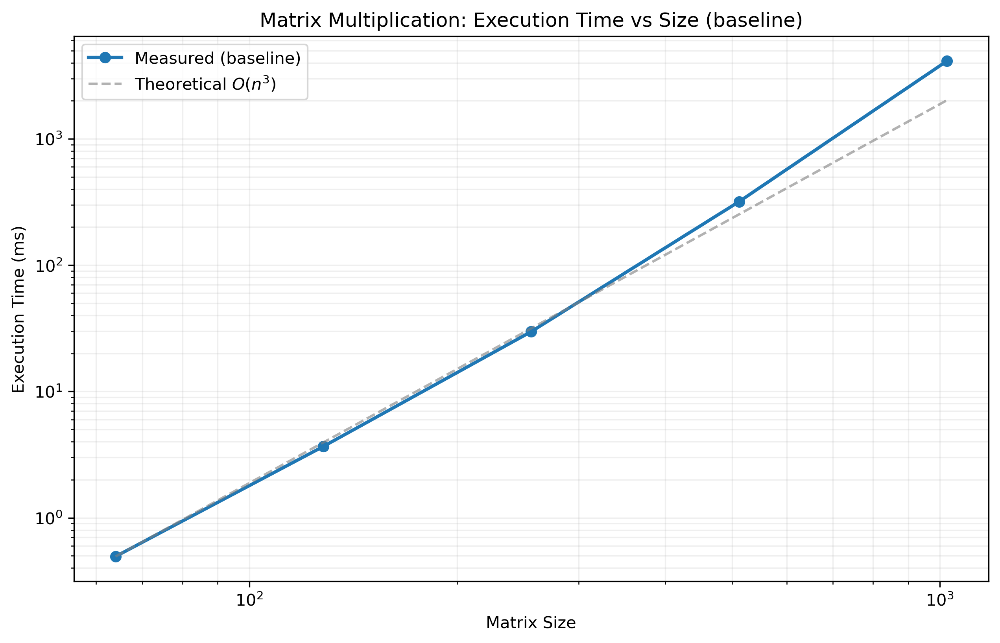
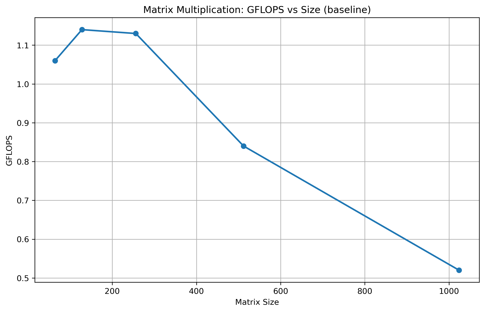
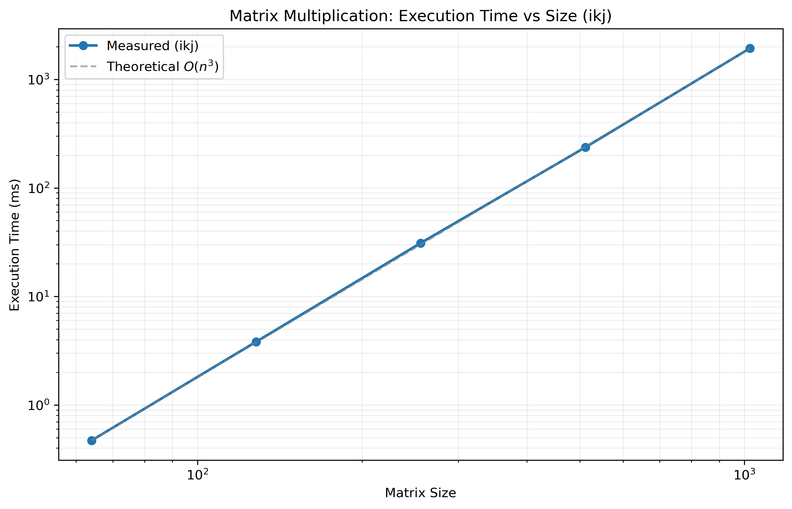
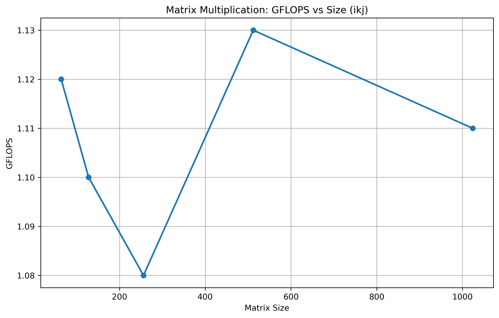
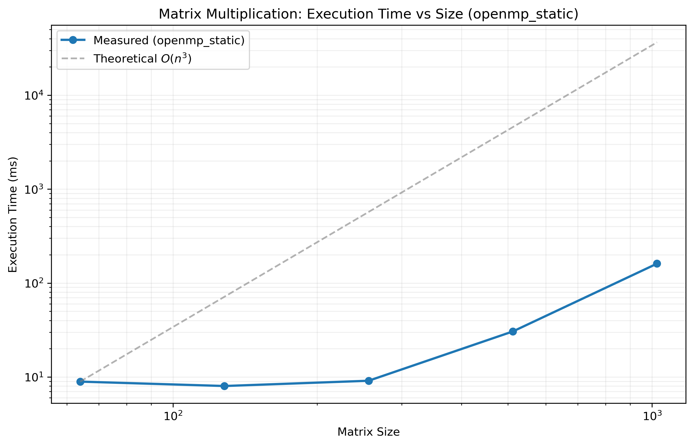
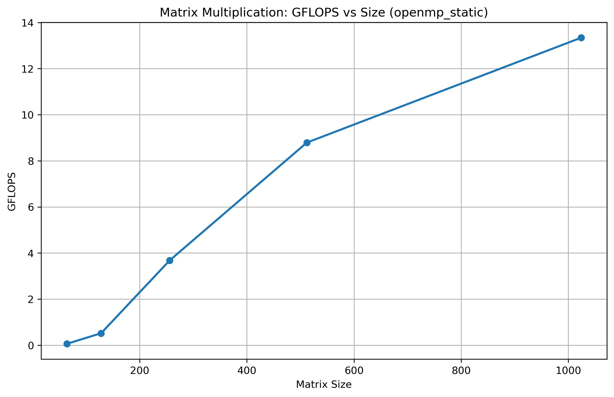

# Matrix Multiplication Optimization Log

## Baseline

### Implementation

The native `matrix_multiply()` implementation relies on an i-j-k loop structure, which leads to suboptimal performance as matrix dimensions scale. Benchmarks accross sizes 64 to 1024 reveal that efficiency peaks at $N=128$ or $256$, followed by a sharp decline. Then the efficiency quickly decreases with larger sizes.

This is due to the non-squential memory access patters of the i-j-k loop, which hinder effective CPU caching. Since the data is not contiguous, the CPU frequently encounters cache misses and must stall while fetching data from main memory. As dimensions increases, the cache miss rate also scales rapidly.

### Performance Data

| Matrix Size | Time (ms)   | GFLOPS |
| ----------- | ----------- | ------ |
| 64          | 0.493348    | 1.06   |
| 128         | 3.669852    | 1.14   |
| 256         | 29.749145   | 1.13   |
| 512         | 318.380984  | 0.84   |
| 1024        | 4133.360043 | 0.52   |

Average GFLOPS: 0.94

Max GFLOPS: 1.14

### Visualization

## i-k-j version

### Implementation

The loop structure was reorderd from i-j-k to i-k-j, result in more consistent performance. Benchmark across matrix sizes ranging from 64 to 1024 demonstrate that the GFLOPS remains stable.

This stability stem from the sequntial memory access pattern inherent in the i-k-j loop. By maintaning a low cache miss rate regardless of matrix size, this pattern significant enhanced CPU efficiency and boosts the overall performance of the implementation.

### Performance Data

| Matrix Size | Time (ms)   | GFLOPS |
| ----------- | ----------- | ------ |
| 64          | 0.469574    | 1.12   |
| 128         | 3.817395    | 1.10   |
| 256         | 31.048955   | 1.08   |
| 512         | 236.537991  | 1.13   |
| 1024        | 1934.566046 | 1.11   |

### Visualization

## OpenMP (static)

### Implementation

Parallelized outer loop (i) with OpenMP leads to a significant improvement on multi-core CPUs. The static schedule assigns tasks equally to each core, which avoids communication among threads. However, for some Intel CPUs with P cores and E cores, the static schedule may lead to an unexpected problem: P cores have to wait for E cores as OpenMP handles each core fairly. Fortunately, benchmark across matrix sizes ranging from 64 to 1024 hasn't show such a problem as small dimensions.

Another bottleneck occurs with small matrices, the OpenMP implementation exhibits significant lower GFLOPS compared to the serial version. This due to the parallel overhead -- the time requiared for thread creation and task assignment. For large matrices, the performance gains from multi-core execution far overweight the overhead of task assignment. The time saved through parallelization effectively offsets the cost of thread orchestration. Conversely, for small matrices, the overhead dominates the execution time, making the serial implementation more effcient.

### Performance Data

| Matrix Size | Time (ms)  | GFLOPS |
| ----------- | ---------- | ------ |
| 64          | 8.928135   | 0.06   |
| 128         | 8.016293   | 0.52   |
| 256         | 9.117705   | 3.68   |
| 512         | 30.527140  | 8.79   |
| 1024        | 160.943062 | 13.34  |

### Visualization

